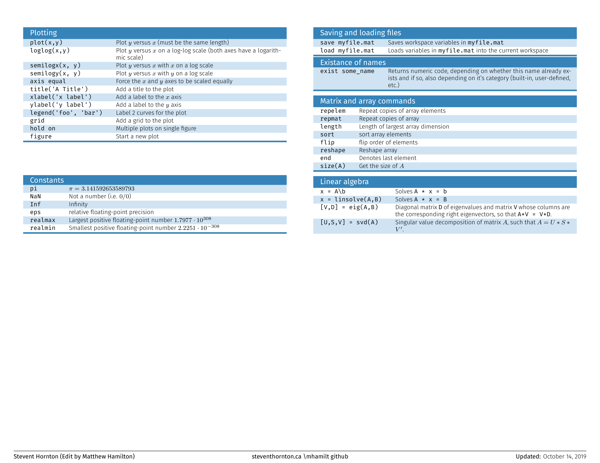
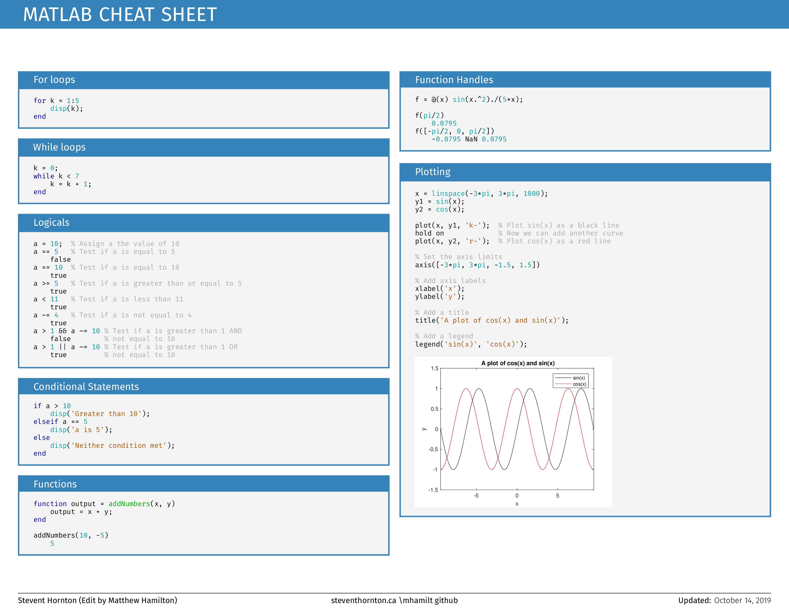

# Matlab-Cheatsheet

This repository contains the LaTeX source used to create a cheatsheet of common Matlab commands. You can also find the source on Overleaf at https://www.overleaf.com/read/qkhfxgpsrdsq.






## Notes

### PNGs
Auto update display pngs with [imagemagick cli](https://imagemagick.org/script/command-line-tools.php)

```bash
magick convert -density 300 MatlabCheatsheet.pdf  MatlabCheatsheet.png
```

### Compile LaTeX

LaTeX compiled with:

```bash
xelatex --file-line-error --synctex=1 -shell-escape MatlabCheatsheet.tex
```
