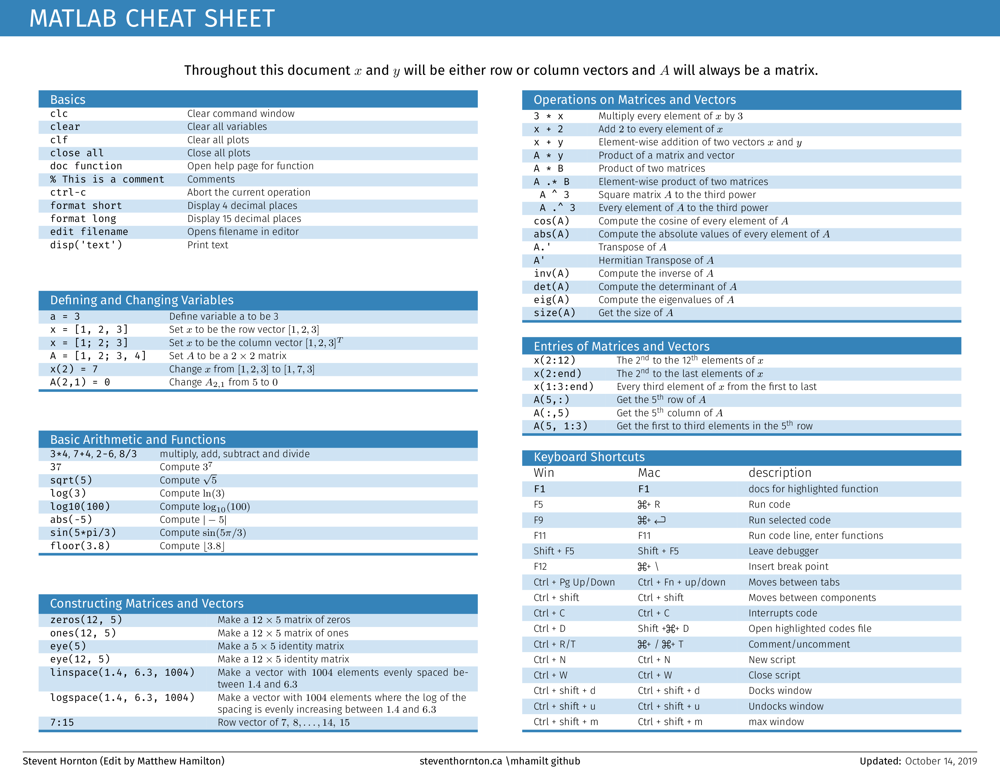

# Matlab-Cheatsheet

This repository contains the LaTeX source used to create a cheatsheet of common Matlab commands. You can also find the source on Overleaf at https://www.overleaf.com/read/qkhfxgpsrdsq.

